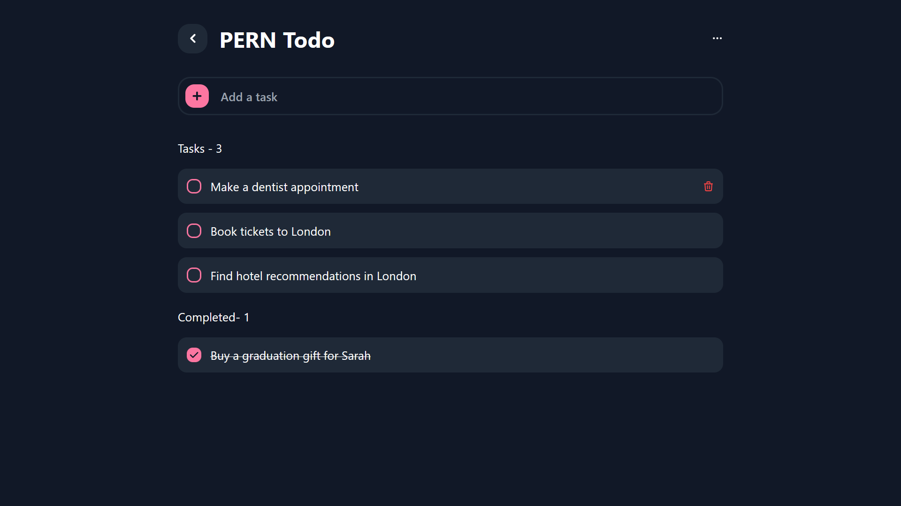

# PERN Todo List

🚧 `WORK IN PROGRESS` 🚧

A very straight-forward and simple todo-list with the PERN Stack (Postgres, Express, React, Node).

> Practicing MobX as a the state-management for the client-side with persistence.

> Serves as a boilerplate for crud functionality

---

## Project Structure

```bash
  ├ 📁client # WIP: connected to postgres server
  ├ 📁client-static # no connection to postgres server
  | └ 📁src
  |   ├ 📁utils
  |   | └ AppStore.ts # MobX store and context hook
  |   └ App.tsx # Main interface
  └ 📁server
    └ 📁src
      ├ 📁entities
      | └ *.ts # Models for Postgres and GraphQL
      ├ 📁migrations
      | └ AppStore.ts # Postgres commands for migration
      |               # more in package.json `migration:*`
      ├ 📁resolvers
      | └ *.ts # GraphQL resolvers (CRUD logic)
      ├ server.ts # Entry point of server
      |           # (contains resolver array)
      └ mikro-orm.config.ts # Config for database connection
                            # (contains entities array)


```

---

## Client-Static Preview

<div align="center">
    
</div>
<br />

## GraphQL Preview

<div align="center">
    
</div>
<br />
